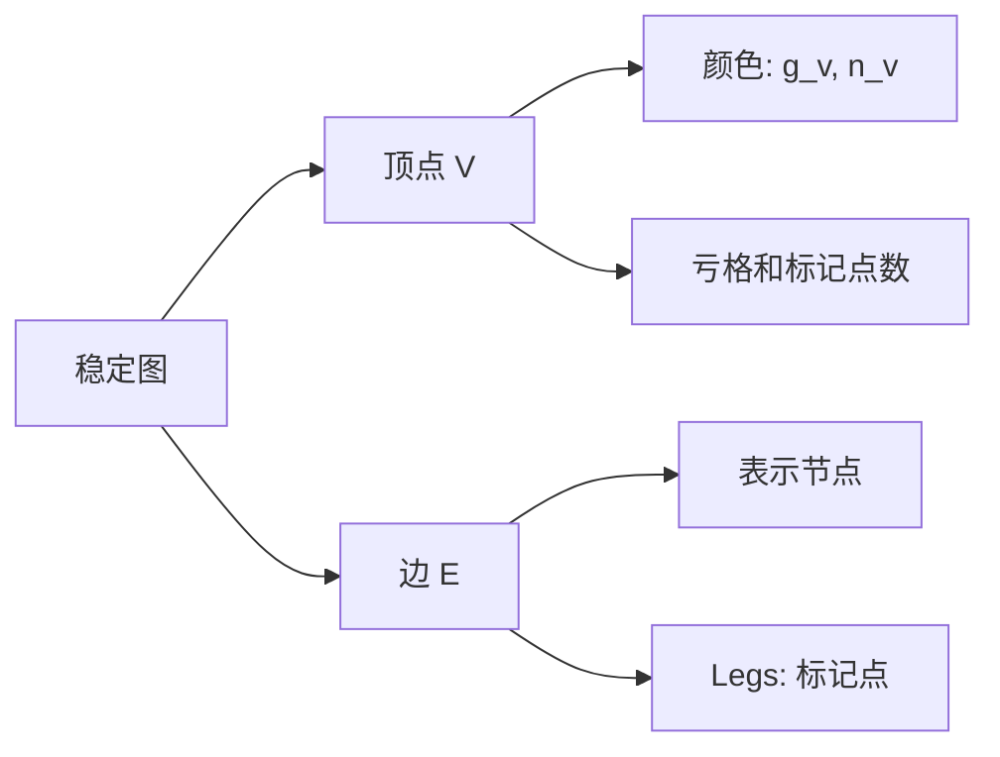

上一次我们提到了拓扑稳定性和表示稳定性，这次的主题是承接上一次的，让我们来看一看Deligne-Mumford cmpactication上的同调稳定性。

## 一、Deligne–Mumford compactication $\overline{M}_{g,n}$

A **stable curve of genus $g$ with $n$ marked points** is a connected algebraic curve over  $\mathbb{C}$  satisfying the following conditions:

1. **Singularities**: All singularities of $C$ are **nodal singularities** (i.e., ordinary double points, where the curve locally looks like  $xy = 0$ ).
2. **Marked Points**: There are $n$ distinct smooth points $p_1, p_2, ..., p_n \in C$ (called marked points), labeled by the finite set $[n] = \{1, 2, ..., n\}$.
3. **Stability Conditions for Irreducible Components**:
    - Every irreducible component of $C$ of genus $0$ (rational component) contains at least **3 special points** (marked point or nodal singularity).
    - Every irreducible component of $C$ of genus $1$ contains at least **1 special point** (marked point or nodal singularity).
4. **Finite Automorphisms**: The group of automorphisms of $C$ is finite. 
   
    This is a consequence of conditions (1)–(3) and ensures the moduli space $\overline{\mathcal{M}}_{g,n}$  is well-behaved (quasiprojective).
    

- 定义：$\overline{M}_{g,n}$是**带n个标记点的g亏格稳定曲线**的模空间，是光滑曲线模空间$M_{g,n}$的“自然紧化”。
- 稳定曲线的关键条件：
    - 奇点仅为**二重点**（ nodal singularities）；
    - 0亏格分支（irreducible component）至少含3个“标记点或奇点”（避免“退化到无意义”）；
    - 1亏格分支至少含1个“标记点或奇点”（同理）。
- 本质：允许光滑曲线退化为奇异曲线(特定类型的)，使模空间成为紧空间。

通过“重标记n个标记点”诱导作用，同调群$H_i(\overline{M}_{g,n})$ 天然拥有 $S_n$ 表示结构；

目标是理解$n \gg 0$时，$\{H_i(\overline{M}_{g,n})\}$的渐近行为。

## 二、FS范畴与FS^op模

### Definition

Let  $\text{FS}$  be the category whose **objects** are non-negative integers (identified with finite sets  $[n] = \{1, 2, ..., n\}$ ) and **morphisms** are surjections  $f: [m] \to [n]$  between finite sets. 

An  $\text{FS}^{\text{op}}$ -module is a contravariant functor  $V: \text{FS}^{\text{op}} \to \text{Vect}_{K}$ , denoted  $n \mapsto V_n$ , where:

- For every surjection $f: [n] \to [m]$ in  $\text{FS}$ , there is a pullback map  $f^*: V_n \leftarrow V_m$  (direction reversed due to contravariance);
- The functoriality holds:  $(f \circ g)^* = g^* \circ f^*$  for composable surjections  $f, g$ , and  $\text{id}_{[n]}^* = \text{id}_{V_n}$ .

An $\text{FS}^{\text{op}}$-module $V$ is **finitely generated in degree ≤ $C$** (for some constant  $C \in \mathbb{N}$ ) if there exist:

1. A finite set of generators  $\{v_1, v_2, ..., v_k\}$, where $v_j \in V_{d_j}$ and $d_j \leq C$ (each generator lies in a vector space of degree ≤  $C$ );
2. For every  $n \in \mathbb{N}$, every element of $V_n$ can be expressed as a linear combination of pullbacks of the generators via surjections:
   
    $$
    V_n = \text{span}\left\{ f_j^*(v_j) \mid 1 \leq j \leq k,\ f_j \in \hom_{FS}([n],[d_j]) \right\}.
    $$
    
3. 

​		Or, We say that an $\mathbf{FS}^{\mathrm{op}}$ module, $n \mapsto V_n$ is finitely generated in degree $\leq C$ if there is a finite list of classes ${v_i \in V_{d_i}}$ with $d_i \leq C$, such that every $V_n$ is spanned by classes of the form $f^* v_i$.

Sam, S., & Snowden, A. (2017). Gröbner methods for representations of combinatorial categories. *Journal of the American Mathematical Society*, 30(1), 159–203.

将$\{H_i(\overline{M}_{g,n})\}$包装成FS^op模，才能用“有限生成性”约束其渐近行为（定理1.2的核心是“这个FS^op模有限生成” ）。

## 三、二元树范畴BT^op与粘合作用

### 1. 为什么需要BT^op？

FS^op不能直接作用在$\overline{M}_{g,n}$上（模空间的态射不直接对应满射，主要是不够自然）；

BT^op是“中间桥梁”——通过“粘合带标记的射影直线$\mathbb P^1$”（恰有3个标记点的射影直线只有一个同构类），诱导模空间的映射，进而传递到同调群，最终赋予$\{H_i(\overline{M}_{g,n})\}$ FS^op模结构。

### 2. BT^op的定义与核心操作

- 定义：
    - 对象：自然数；
    - 态射：带标记的“二元森林”（由二元树组成，叶节点标记$[m]$、根节点标记$[n]$）；
    - 复合：将前一个森林的根与后一个的叶粘合，删除二价顶点。
- 核心操作（粘合$P^1$）：
    - 对态射$F \in BT^{op}(m,n)$，构造曲线$L_F$（由$P^1$组成，对应森林的顶点，刚好每个二叉树节点都对应一个三通），再将$L_F$与$\overline{M}_{g,m}$*中*的曲线$C$粘合，得到$\overline{M}_{g,n}$中的曲线$F^*C$；
    - 这个操作诱导同调群的拉回映射$F^*: H_i(\overline{M}_{g,n}) \leftarrow H_i(\overline{M}_{g,m})$，且与FS范畴的满射一一对应（命题2.7证明“不同森林诱导同一满射时，同调映射相同”）。
      
        
        

因此我们得到一个结论： 亏格为0的点组成的结构并不会影响最后诱导出来的同调群上的结构，因此我们可以考虑将亏格为0的部分精简后的等价类结构，事实上这也是考虑分层的思路。

Example：

直接实现“FS^op模结构”——BTop的粘合作用是$\{H_i(\overline{M}_{g,n})\}$成为FS^op模的“具体手段”。

## 四、表示稳定性（Representation Stability）

基础：研究$n \to \infty$时，$S_n$表示序列$\{V_n\}$（此处$V_n=H_i(\overline{M}_{g,n})$）的“规律性”；

恰如三周前曾经讲过的表示稳定性

论文中的特殊性：上次给出的例子里$\dim H_i(V_n)$ 是多项式增长，而这次的例子里 $\dim H_i(\overline{M}_{g,n})$是**指数增长**，同样不满足“维度稳定”的朴素定义，但满足“结构稳定”——即生成函数有理性、表示分解有约束、有限数据可决定所有$n$的情况。

论文的研究目标本质是“证明$\{H_i(\overline{M}_{g,n})\}$满足表示稳定性”，而FS^op模的“有限生成性”是实现这一目标的关键工具（而且FI模和FS^op模在一定程度上很是相似，只是FS^op保留了更多的信息）。

## 五、稳定图与粗化分层$Q(g,n)$

### 1.1 稳定曲线 (Stable Curves)(前文提过，这里快速复述引出稳定图)

**定义**：设 $S$ 是一个概型，$g \geq 2$。一个亏格 $g$ 的稳定曲线 over $S$ 是一个真平坦态射 $\pi: \mathbb{C} \rightarrow S$，其几何纤维 $\mathbb{C}_s$ 满足：

- **条件(i)**：$\mathbb{C}_s$ 只有通常双点（ordinary double points）作为奇点
- **条件(ii)**：如果 $E$ 是 $\mathbb{C}_s$ 的一个非奇异有理分量（亏格0），则 $E$ 与其他分量的交点多于2个
- **条件(iii)**：$\dim H^1(\mathcal{O}_{\mathbb{C}_s}) = g$（亏格条件）

**关键性质**：

- 自同构群有限
- 构成模空间 $\overline{M}_{g,n}$ 的点的几何对象
- 允许节点和标记点，用于紧化模空间

### 1.2 稳定图 (Stable Graphs)

**定义**：一个类型为 $(G,N)$ 的稳定图是一个着色无向多重图 $\mathcal{G} = (V,E)$，满足：

1. 每个顶点 $v$ 有颜色 $(g_v, n_v)$
2. $\mathcal{\Gamma}$ 连通
3. 总亏格：$\sum_{v \in V} g_v + |E| - (|V| - 1) = G$
4. 总标记点数：$\sum_{v \in V} n_v = N$
5. 稳定性条件：对每个 $g_v = 0$ 的顶点 $v$，有 $\deg v + n_v \geq 3$.

Lemma (1.16). — If φ induces the identity on Γ, then φ is the identity.

### 2. 粗化分层$Q(g,n)$（必须讲清“为什么使用这个等价类”， 提示：参考定理2.7）

- 传统分层问题：标准的稳定图分层$Stab(g,n)$ 不兼容FS^op作用（FS^op的粘合操作会跨层，导致谱序列无法适配）；
  
- 粗化操作：将“仅由0亏格顶点和边组成的子图”收缩为单个顶点，得到$Q(g,n)$（无两个0亏格顶点相邻的稳定图集合）；

- 作用：$Q(g,n)$的分层能适配FS^op作用，进而诱导“FS^op模结构的Borel–Moore同调谱序列”（命题3.17），是证明有限生成性的技术基础。

## 六、证明关键：WDVV关系与同调消失性（选讲）

### 1. WDVV关系

- 定义： genus 0模空间$\overline{M}_{0,4}$的同调关系——$\overline{M}_{0,4}$的三个边界 strata 的基本类成比例（因$\overline{M}_{0,4} \cong P^1$连通）；
- 论文中作用：化简同调类——若稳定图$G$含“两个相邻的0亏格三价顶点”，WDVV关系可将$M_G$的同调类转化为含“外部Y结构”的 strata 的同调类，进而证明该类“可由低 degree 类拉回得到”（有限生成性的核心一步）。

### 2. 同调消失性（命题5.6）

- 陈述：对$M_{g,n}$（光滑曲线模空间），当$i < n-1$时，Borel–Moore同调$H_i^{BM}(M_{g,n})=0$；
- 作用：限制“有贡献的 strata”——仅稳定图$G$中“所有内部顶点的 valence-3 之和≤i”的 strata $M_G$，才对$H_i(\overline{M}_{g,n})$有贡献，大幅缩小了需考虑的 strata 范围，为“有限生成”提供约束。

## 七、概念间的逻辑链（细讲时需强调）

$\overline{M}_{g,n}$（研究对象）→ BTop粘合作用（传递工具）→ $\{H_i(\overline{M}{g,n})\}$的FS^op模结构（核心框架）→ 稳定图粗化分层（技术适配）→ WDVV+同调消失（证明工具）→ FS^op模有限生成（定理1.2）→ 表示稳定性（定理1.1/1.4）。

定理1.2（FS^op模有限生成性）的证明核心如下：

### 核心目标

证明：对固定g,i∈ℕ，FS^op模$n \mapsto H_i(\overline{\mathcal{M}}_{g,n}, \mathbb{Q})$是“度≤$C$（$C=O(g^2i^2)$）的有限生成FS^op模的扩张的子商”，即所有同调类可由degree≤$C$的有限个生成元通过满射拉回映射生成。

### 关键步骤（3步核心逻辑）

1. **适配FS^op作用的分层构造**
   
    引入粗化稳定图分层$Q(g,n)$（无不同0亏格顶点相邻的稳定图集合），解决标准分层与FS^op作用不兼容的问题。通过该分层诱导Borel–Moore同调谱序列，且证明该谱序列是FS^op模谱序列（命题3.17），为后续利用FS^op模性质铺垫。
    
2. **约束有贡献的稳定图类型**
   
    利用组合引理（Lemma4.1）和同调消失性（命题5.6）：
    
    - 组合引理：当$n>C$时，若稳定图$G∈Q(g,n)$无“高 valence 亏格≥1顶点”，则其0亏格顶点必有大量外部边；
    - 同调消失性：光滑模空间$M_{g,n}$的Borel–Moore同调$H_i^{BM}(M_{g,n})=0$（$n>i+3$），排除“高 valence 亏格≥1顶点”对应的 strata 贡献，仅需关注含0亏格顶点的稳定图。
3. **同调类的化简与生成性证明**
   
    对含大量外部边的0亏格顶点对应的同调类，分两种情况化简：
    
    - 若稳定图含“外部Y结构”（三价0亏格顶点连两条外部边）：其同调类可由低n的同调类通过FS^op拉回映射生成；
    - 若含“两个相邻三价0亏格顶点”：通过WDVV关系（命题5.3）将其转化为含“外部Y结构”的同调类，进而也可由低n类生成。

### 结论

所有$n>C$时的同调类$H_i(\overline{\mathcal{M}}_{g,n})$，均可由degree≤$C$的有限个同调类通过FS^op模的拉回映射生成，故该FS^op模是有限生成的（或其子商为有限生成）。

## 八、总结

开放性问题：

- 有效界问题：$*M(g,i)*$（生成函数分子次数）、$*N*$（有限数据阈值）的具体有效估计；
- 最优界问题：当前$*O(g^2i^2)*$的生成度界是否可改进为线性或更低阶？
- 拓展研究：FS^op 模的表示论细化、其他 operad 作用下的有限生成性、l 进系数同调的推广。